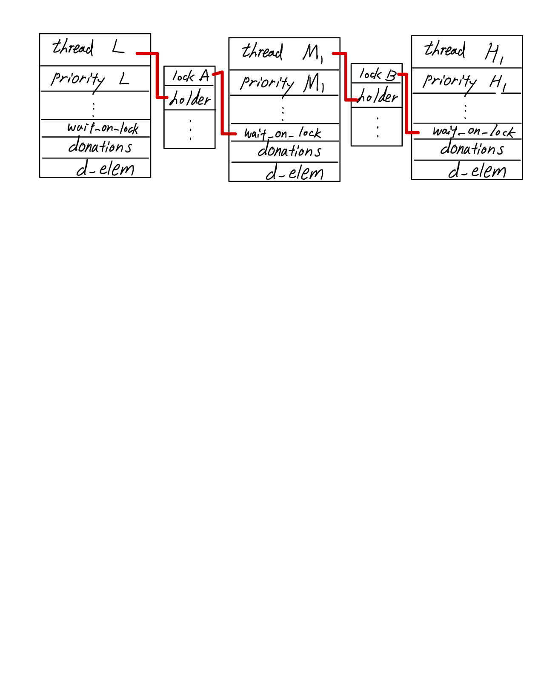

           +--------------------+
            |        EE 415      |
            | PROJECT 1: THREADS |
            |   DESIGN DOCUMENT  |
            +--------------------+

---- GROUP ----

>> Fill in the names and email addresses of your group members.

조은영 <eunyeong5433@kaist.ac.kr>

전승훈 <kaist_jsh@kaist.ac.kr>

---- PRELIMINARIES ----

>> If you have any preliminary comments on your submission, notes for the
>> TAs, or extra credit, please give them here.

extra credit 구현: ready list를 두 개의 list로 나누어 0~31의 priority를 갖는 thread와 32~63의 priority를 갖는 thread를 따로 저장하였다.

>> Please cite any offline or online sources you consulted while
>> preparing your submission, other than the Pintos documentation, course
>> text, lecture notes, and course staff.

2020 EEOS lecture note (OSLab website course)

                 ALARM CLOCK
                 ===========

---- DATA STRUCTURES ----

>> A1: Copy here the declaration of each new or changed `struct' or
>> `struct' member, global or static variable, `typedef', or
>> enumeration.  Identify the purpose of each in 25 words or less.

Thread.c
structure list sleep_list: sleep 상태의 thread 저장
int64_t global_tick: sleep list의 thread 중에서 최소의 wakeup_ticks를 저장

Thread.h
In thread structure
int64_t wakeup_ticks: thread가 awake되어야 할 tick을 저장

---- ALGORITHMS ----

>> A2: Briefly describe what happens in a call to timer_sleep(),
>> including the effects of the timer interrupt handler.

timer sleep이 call 되면, timer interrupt에 의해 증가하는 tick을 return 받아, 현재 timer tick과 sleep 할 시간을 더해 thread를 awake할 시간을 결정한 후 thread_sleep 함수로 넘긴다. thread_sleep 함수에서는 thread structure의 wakeup_tick 변수를 넘겨받은 시간으로 설정한 후 sleep list에 push 및 thread block을 수행한다. timer interrupt에 의해 증가하는 tick 값이 awake할 시간이 되면 thread awake가 호출 될 것이다.

>> A3: What steps are taken to minimize the amount of time spent in
>> the timer interrupt handler?

sleep list에서 awake 해야 할 tick(wakeup_tick)이 최소인 thread의 wakeup_tick (global_tick) 을 timer.c에서 return_global () 함수로 받아와서, 현재 tick보다 global tick이 작을 때, 즉 wake up 해야 할 thread가 있을 때만 thread awake 함수를 호출한다.

---- SYNCHRONIZATION ----

>> A4: How are race conditions avoided when multiple threads call
>> timer_sleep() simultaneously?

thread가 sleep list에 add가 되는 시점에서 interrupt가 disable인 상태를 보장하기 때문에 race condition을 피할 수 있다.

>> A5: How are race conditions avoided when a timer interrupt occurs
>> during a call to timer_sleep()?

timer_sleep 을 할 때 내부 함수인 thread_sleep 에서 interrupt_disable()을 해서 새로운 interrupt 를 무시하기 때문에 sleep이 call 되었을 때 interrupt가 발생해도 race condition이 발생하지 않는다.

---- RATIONALE ----

>> A6: Why did you choose this design?  In what ways is it superior to
>> another design you considered?

insert 할 때 wakeup_tick의 순서대로 정렬하여 push를 하면 thread_awake 시 while문을 끝까지 돌지 않고도 깨워야 할 thread 와 다음 global tick 값을 구할 수 있어 효율적일 수 있다고 생각했다.

             PRIORITY SCHEDULING
             ===================

---- DATA STRUCTURES ----

>> B1: Copy here the declaration of each new or changed `struct' or
>> `struct' member, global or static variable, `typedef', or
>> enumeration.  Identify the purpose of each in 25 words or less.

Thread.h
thread
int original priority: thread의 real priority로, priority donation 등이 일어나 thread의 priority가 일시적으로 변할 때 원래 값을 저장하기 위한 변수이다.
struct list donations: priority donation이 일어날 때, 해당 thread에게 priority를 donate해 준 donor들의 list이다.
struct lock wait_on_lock: priority donation이 일어날 때, 해당 thread들이 어떤 lock을 기다리며 priority를 제공 중인지 알 수 있는 변수다.
struct list_elem d_elem: donation list에 들어가는 thread의 element들이다.

>> B2: Explain the data structure used to track priority donation.
>> Use ASCII art to diagram a nested donation.  (Alternately, submit a
>> .png file.)

본 팀은 priority donation을 위해 제공된 guide PPT의 그림을 참고하여 위 그림과 같은 구조를 설계하였다. lock A를 점유한 thread -> lock A를 기다리는 thread -> lock A를 기다리는 thread가 lock B를 점유 중 -> lock B를 기다리는 thread -> … 로 이어지는 nested 구조의 경우를 고려하기 위해 위 그림의 wait_on_lock, holder와 같은 structure element들을 도입하며 thread를 서로 link하여 tracking할 수 있었다.

---- ALGORITHMS ----

>> B3: How do you ensure that the highest priority thread waiting for
>> a lock, semaphore, or condition variable wakes up first?

lock_relase 함수에서 sema_up 이라는 내부 함수가 실행되는데, semaphore의 waiters list에 들어있는 element 를 priority에 기반하여 정렬하고, 가장 높은 priority를 지닌 thread를 unblock하기 때문이다.

>> B4: Describe the sequence of events when a call to lock_acquire()
>> causes a priority donation.  How is nested donation handled?

현재 lock holder의 priority가 현재 thread의 priority보다 낮은 경우 priority donation이 일어나게 되는데, 먼저 lock을 요청하는 현재 thread의 wait_on_lock을 설정해 주고, 이 thread가 lock holder에 priority donation을 수행하기 때문에 lock holder의 donations list에 push를 해 준다. 그리고 nested donation의 경우를 처리하기 위해서 현재 lock holder, 해당 lock holder가 wait 하는 lock의 holder, 다음 lock holder가 wait 하는 lock의 holder 등 연결된 자료구조를 순차적으로 돌면서 현재 thread의 priority가 더 높은 경우 priority donation을 수행한다.

>> B5: Describe the sequence of events when lock_release() is called
>> on a lock that a higher-priority thread is waiting for

이전에 donation을 받았던 priority를 current_thread()의 original priority로 변경하고, wait_list에서 현재 release 되는 lock을 waiting하는 thread가 있을 시 해당 thread를 wait list에서 제거한다. 아직 donor list (donations)가 비어있지 않다면, 새롭게 현재 thread의 priority를 계산하기 위해 donor list에서 list max 함수로 찾은,  priority가 가장 높은 thread의 priority를 현재 thread의 priority로 설정해준다.

---- SYNCHRONIZATION ----

>> B6: Describe a potential race in thread_set_priority() and explain
>> how your implementation avoids it.  Can you use a lock to avoid
>> this race?

thread set priority 과정에서 발생할 수 있는 race condition의 예시로는,1번 thread에서 thread_set_priority가 호출이 되어 priority를 변경하고자 할 때  2번 thread가 1번 thread의 priority에게 priority donation 등으로 영향을 미칠 수 있다. 이를 방지하기 위해 thread_set_priority 함수 내부에서 interrupt를 비활성화한다.

lock을 사용해서 race condition을 없애기 위해서는 관련있는 모든 공유 변수들에 lock을 씌워줄 수 있을 것이다.. 다만, 모든 변수에 lock을 씌울 경우 일부 함수에서는 dead_lock이 발생할 위험이 있다.

---- RATIONALE ----

>> B7: Why did you choose this design?  In what ways is it superior to
>> another design you considered?

priority 기반의  scheduling은 우선적으로 처리해야 할 thread를 고려하여 중요한 thread를 먼저 처리할 수 있다는 장점이 있다. priority 값을 기준으로 단순한 ready_list의 정렬은 priority inversion 문제를 초래할 수 있다. 이는 ready_list 의 가장 높은 priority보다 더 높은 priority를 지닌 thread가 lock을 기다리고 있음에도 preempt가 진행되는 문제이다. 이를 해결하기 위해 lock 을 기다리는 thread들의 list인 wait_list의 가장 높은 priority 값을 빌려주는 donation 방법이 도입되었다. lock을 기다리는 thread 들의 구조에 따라 nested, multiple donation 문제로 나눠질 수 있는데, B5, B6에서 본 팀이 제시한 방법은 위와 같은 문제들을 모두 해결할 수 있는 방법이다.

본 팀에서는 wait list와 ready list 에 thread element를 추가할 때 priority ordered 로 insert 하였기 때문에 매번 모든 list element를 확인할 필요가 없이 가장 앞에 있는 것을 pop 하여 사용하는 효율적인 구조를 만들었다. 이 구조는 깔끔한 코드 구현이 가능한 반면, O(n^2) 의 complexity를 갖고 있다. 반면, 순서에 상관없이 push_back을 한 이후에 list 내부 모든 element를 확인하여 maximum priority를 찾는 것은 O(n) 의 complexity를 갖는다. 따라서, 함수 실행 속도를 더욱 빠르게 하기 위해서는 ordered_insert 보단 inordered insert 이후 maximum priority를 찾는 것이 좋을 것이다.

              ADVANCED SCHEDULER
              ==================

---- DATA STRUCTURES ----

>> C1: Copy here the declaration of each new or changed `struct' or
>> `struct' member, global or static variable, `typedef', or
>> enumeration.  Identify the purpose of each in 25 words or less.

Thread.c
load_average: load average 값을 저장하는 변수이다.
static int f = 1<<14: floating point 연산을 하기 위해 정의하였다.
Thread.h
nice, recent_cpu: 해당 thread의 nice값과 recent cpu 값을 저장하는 변수이다.

---- ALGORITHMS ----

>> C2: Suppose threads A, B, and C have nice values 0, 1, and 2.  Each
>> has a recent_cpu value of 0.  Fill in the table below showing the
>> scheduling decision and the priority and recent_cpu values for each
>> thread after each given number of timer ticks:

timer  recent_cpu    priority   thread
ticks   A   B   C   A   B   C   to run
-----  --  --  --  --  --  --   ------
0      0    0    0   63 61  59      A
4      4    0    0   62 61  59      A
8      8    0    0   61 61  59      A
12    12   0    0   60 61  59      B
16    12   4    0   60 60  59      B
20    12   8    0   60 59  59      A
24    16   8    0   59 59  59      A     
28    20   8    0   58 59  59      C
32    20   8    4   58 59  58      B
36    20   12  4   58 58  58      B

>> C3: Did any ambiguities in the scheduler specification make values
>> in the table uncertain?  If so, what rule did you use to resolve
>> them?  Does this match the behavior of your scheduler?

같은 priority를 가진 thread가 생기는 경우, thread to run을 결정하기 모호했다.
본 팀의 코드에서는 current thread의 priority와 ready list 의 maximal priority thread를 비교하는 operator가 strictly greater (<) 이므로 priority가 동일할 경우에 thread_yield가 발생하지 않는다. 따라서, C2 의 4->8 tick, 20->24 tick과 32->36 tick에 있어서 priority는 동일하지만 running thread가 A->B로 전환되지 않는다 (thread_yield function not executed).

>> C4: How is the way you divided the cost of scheduling between code
>> inside and outside interrupt context likely to affect performance?

기존 guideline에서는 4 tick 마다 모든 thread의 priority를 계산하라고 명시되어 있었다. priority 값은 recent_cpu 와 nice 값을 변수로 갖는다. recent_cpu 는 load_avg와 nice 값에 의해 변화한다. load_avg과 전체 thread의 recent cpu값은 1sec 마다 변화하고, 1tick 마다 현재 thread만의 recent cpu 값이 변화하기 때문에 4 tick마다 current_thread의 priority만 업데이트 함으로써 계산 효율성을 높인다.

---- RATIONALE ----

>> C5: Briefly critique your design, pointing out advantages and
>> disadvantages in your design choices.  If you were to have extra
>> time to work on this part of the project, how might you choose to
>> refine or improve your design?

본 팀에서는 Multi ready queue를 구현하였다. 기존 알고리즘에서는 단일 ready_list를 높은 priority 기반으로 매번 정렬한다. 그러나 단일 ready_list 만을 사용할 경우 내부 구성 요소가 많아질 수록 정렬하는 데 시간의 낭비가 크다. 따라서, priority 구간별로 ready_list 를 여러 개 나누어서 (본 팀에서는 0~31, 32~63 두 구간으로 나누었다.) 정렬 시간을 단축함으로써 계산 효율성을 높였다.

큰 priority 를 다루는 ready_list 는 RR 방식을 적용하고, 작은 priority 를 다루는 ready_list는 FIFO 방식을 적용할 경우에 작은 priority thread가 무기한 대기하는 현상을 방지할 수 있을 것이다.

>> C6: The assignment explains arithmetic for fixed-point math in
>> detail, but it leaves it open to you to implement it.  Why did you
>> decide to implement it the way you did?  If you created an
>> abstraction layer for fixed-point math, that is, an abstract data
>> type and/or a set of functions or macros to manipulate fixed-point
>> numbers, why did you do so?  If not, why not?

리눅스 기본 커널에서는 real type을 지원하지 않는다. recent_cpu나 load_avg를 업데이트 하기 위해서는 실수 타입의 계산이 필요하다. 기존 32bit 를 다루 int 형에서, 1개의 부호, 17개의 정수형 , 14개의 소수로 표현하는 17.14 방법을 사용하여 real number를 구현하였다. int 에서 fixed_point arithmetic으로 전환하는 계산이 필요한데, 이를 가장 기본 단위인 F라고 명명했다. int 값에서 F 를 곱하면 fp type으로 전환이 가능하다. F는 32 bit 1 값을 14만큼 왼쪽으로 indent 한 값이다. fp type끼리의 사칙연산은 덧셈, 뺄셈은 단순 operator를 통해 구현할 수 있고, 곱셈과 나눗셈을 할 때는 F값이 중복되기 때문에 각각 한 번 나눠주고, 곱해주는 과정이 요구된다. 본 팀에서는 fixed-point math를 위한 추가적인 header file을 작성하지 않았는데, 매 연산마다 function call 을 하는 것 보다 직접 계산하는 게 효율적일 것 같아서 함수 내부에 계산 과정을 모두 작성하였다.

               SURVEY QUESTIONS
               ================

Answering these questions is optional, but it will help us improve the
course in future quarters.  Feel free to tell us anything you
want--these questions are just to spur your thoughts.  You may also
choose to respond anonymously in the course evaluations at the end of
the quarter.

>> In your opinion, was this assignment, or any one of the three problems
>> in it, too easy or too hard?  Did it take too long or too little time?

주어진 태스크는 많지 않지만, 디버깅 하고 알고리즘을 생각하는 데 있어서 많이 어렵고 시간도 많이 사용됩니다.

>> Did you find that working on a particular part of the assignment gave
>> you greater insight into some aspect of OS design?

OS 의 기본 구조에 대해 탐구할 수 있는 좋은 시간이었습니다.

>> Is there some particular fact or hint we should give students in
>> future quarters to help them solve the problems?  Conversely, did you
>> find any of our guidance to be misleading?

함수에 대해 좀 자세히 설명해주셨으면 합니다. 함수가 너무 많고 구현할 기능도 다양해서 설명이 부족할 시 디버깅이 힘듭니다.

>> Do you have any suggestions for the TAs to more effectively assist
>> students, either for future quarters or the remaining projects?

ppt에 코드 설명을 자세히 해주셨으면 합니다. (extra credit 과제 포함)

>> Any other comments?

NO!
